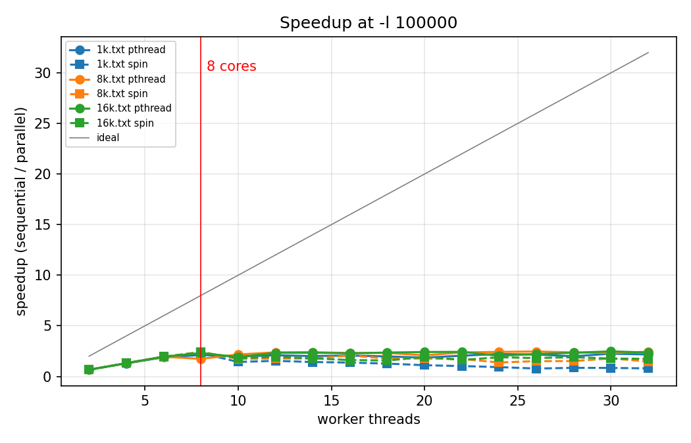
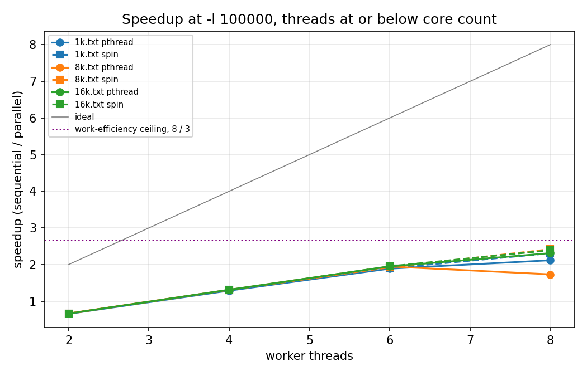
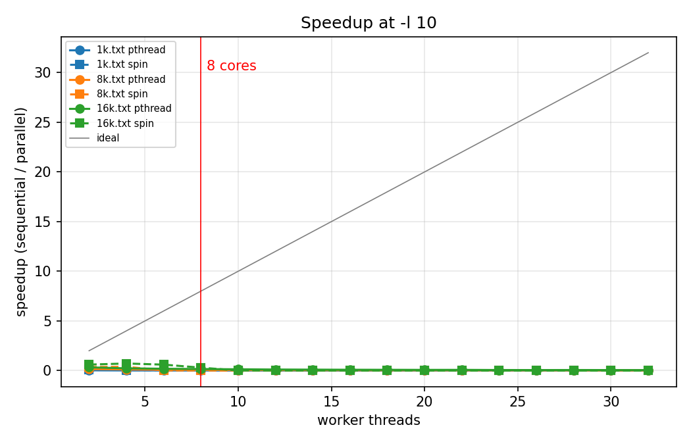
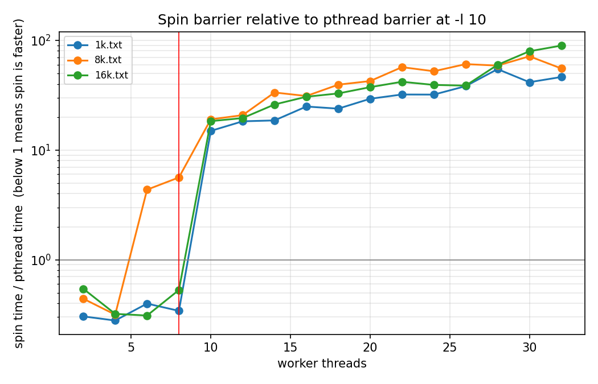
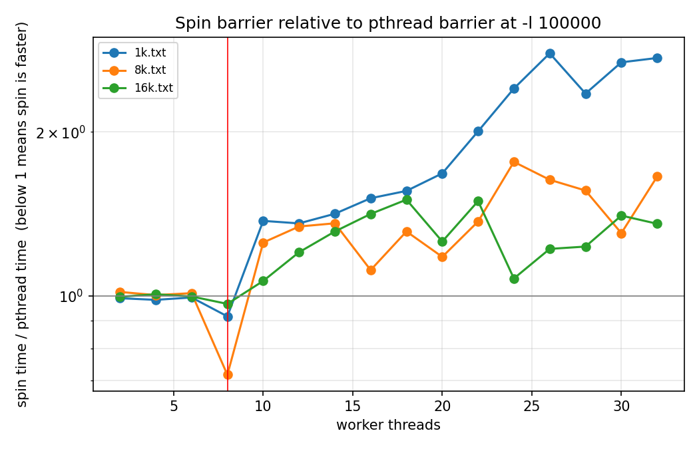

# CS380P Lab 1: Prefix Scan and Barriers

Kyle Stanford

---

## 1. Approach

I implemented the work-efficient parallel prefix scan described in the GPU Gems chapter
referenced by the assignment: an up-sweep that reduces the array as a balanced binary tree,
followed by a down-sweep that pushes partial sums back down. Both passes do `n - 1` operator
calls, so total work is `O(n)`, matching the sequential version's complexity.

The sweeps produce an exclusive scan. The assignment requires an inclusive one, so a third pass
combines each element of the exclusive result with the corresponding input. That pass is fully
data-parallel.

The array is padded to the next power of two with zeros, the identity for the operator, since
input size is not guaranteed to be a power of two. The skeleton's `next_power_of_two` helper
does this. Padding cannot affect any real output because combining with the identity is a
no-op.

Work is divided by giving each thread a contiguous slice of the nodes active at the current
tree level. The remainder is spread one element per thread across the leading threads rather
than concentrated on the last. At the upper levels there are fewer active nodes than threads,
so some threads receive empty slices, but they still participate in every barrier.

All threads synchronise between tree levels because each level reads slots the previous level
wrote. A run on 16384 elements crosses 31 barriers.

I should state one consequence of this algorithm up front, because it explains nearly every
measurement in this report. The up-sweep, down-sweep and inclusive-conversion pass together
perform roughly `3n` operator calls, against `n` for the sequential loop. The algorithm is
work-efficient in the asymptotic sense the assignment requires, but the constant factor is 3.
On a machine with `p` cores the best achievable speedup is therefore about `p/3`, not `p`.

**Measurement setup.** All measurements were taken on the Codio environment, which reports 8
cores. Each configuration was run five times and the minimum was kept. Minimum rather than mean
because the machine is shared, and interference from other tenants can only slow a run down,
never speed it up, so the fastest observation is the closest estimate of true cost. Timing uses
the skeleton's existing instrumentation, which covers the scan only. Buffer allocation and
barrier construction happen before the timer starts.

---

## 2. Step 1: scaling with the pthread barrier at `-l 100000`





Speedup is sequential time divided by parallel time, so higher is better and the grey diagonal
is ideal linear scaling.

| Threads | 1k | 8k | 16k |
|---|---|---|---|
| 2 | 0.65 | 0.67 | 0.66 |
| 4 | 1.29 | 1.31 | 1.31 |
| 6 | 1.89 | 1.95 | 1.95 |
| 8 | 2.12 | 1.73 | 2.31 |
| best | 2.24 | 2.46 | 2.47 |

### Explain the trends in the graph. Why do these occur?

Three things are happening.

**Two threads are slower than sequential, by almost exactly 1.5x on every input.** This is not
overhead, it is the work constant. The parallel algorithm performs three times the operator
calls of the sequential loop. Split across two threads, each thread still performs 1.5 times
the work that the single sequential thread performs. The predicted slowdown is `3/2 = 1.50` and
the measured values are 1.53, 1.50 and 1.51. The agreement across three input sizes is strong
evidence that the work-complexity model, not measurement noise, is what governs this region.

**Speedup then climbs roughly linearly but on a shallower slope than ideal.** Each additional
thread divides the same `3n` work further. The curve tracks `p/3` rather than `p`, which is why
it sits well below the diagonal from the start. Crossing 1.0, the point at which parallel first
beats sequential, happens between two and four threads, consistent with needing more than three
threads before triple work divided `p` ways beats single work done once.

**Past 8 threads the curve flattens and becomes noisy.** The machine has 8 cores. Beyond that
there is no additional parallelism to exploit, so extra threads add barrier participants and
scheduling pressure without adding throughput. The best results cluster between 2.2 and 2.5
regardless of how many threads beyond 8 are used.

The ceiling deserves emphasis. With 8 cores and a work constant of 3, the theoretical maximum
is `8/3 = 2.67`. The measured peaks are 2.47 on 16k and 2.46 on 8k, which is 93 percent of the
bound. The implementation is close to the limit of what this algorithm can deliver on this
machine, and the distance from ideal linear speedup is explained almost entirely by the work
constant rather than by synchronisation inefficiency.

Larger inputs scale slightly better. 16k reaches 2.47 and 1k only 2.24, because barrier count
grows as `log2(n)` while work grows as `n`. Going from 1024 to 16384 elements multiplies work
by 16 but barrier crossings only rise from 21 to 31, so coordination is amortised over more
useful work.

---

## 3. Step 2: reducing the operator cost to `-l 10`



| Threads | 1k seq/par | 8k seq/par | 16k seq/par |
|---|---|---|---|
| 2 | 0.03 | 0.16 | 0.33 |
| 8 | 0.01 | 0.07 | 0.16 |
| 32 | 0.003 | 0.02 | 0.05 |

### What happened and why?

The parallel version never beats sequential at any thread count on any input, and it gets
worse as threads are added. On 1k the sequential scan takes 23 microseconds while two threads
take 804, a 35-fold slowdown, and 32 threads take 7637, a 332-fold slowdown.

The reason is that the total work has collapsed but the coordination cost has not. With
`-l 100000` each operator call is expensive enough that useful computation dominates. With
`-l 10` an operator call is a handful of instructions, so a 1024-element scan is only
microseconds of real work. Against that, thread creation, 21 barrier crossings and the cache
traffic of moving the array between cores are enormous.

This is why the curves slope downward rather than flattening. Every extra thread adds another
participant that all the others must wait for at all 21 barriers, and adds nothing meaningful,
because there was never enough work to justify the first two threads.

Note that the slowdown is least severe on the largest input. 16k at two threads is only 3x
slower while 1k is 35x slower. Same reason as before: more work per barrier.

---

## 4. Step 2: finding the inflection point


I swept `-l` from 1 to 5000 with the thread count fixed at 8, the core count, and compared
against the sequential path.

| Input | Sequential still faster at | Parallel faster at | Crossover near |
|---|---|---|---|
| 1k | `-l 2000` (6701 vs 7341 us) | `-l 5000` (16577 vs 9457 us) | `-l` ≈ 2500 |
| 8k | `-l 200` (5236 vs 6894 us) | `-l 500` (13388 vs 8138 us) | `-l` ≈ 300 |
| 16k | `-l 100` (5084 vs 6943 us) | `-l 200` (10461 vs 8234 us) | `-l` ≈ 150 |

The crossover falls sharply as input size grows. Sixteen times more data moves the inflection
point down by a factor of roughly 16, from about 2500 to about 150.

### Why can changing this number make the sequential version faster than the parallel?

Because `-l` sets how much useful work each operator call represents, while the parallel
version's overhead is almost independent of it.

Look at the parallel column in the sweep. Between `-l 1` and `-l 100` on 1k, parallel time
barely moves: 2563, 2532, 2428, 2513, 2275, 2315, 2417 microseconds. Meanwhile sequential time
rises from 5 to 297 microseconds, tracking `-l` almost exactly. The parallel version is sitting
on a floor of roughly 2500 microseconds made up of thread creation and barrier crossings, and
that floor is paid whether the operator is trivial or expensive.

So the comparison is between a sequential cost that scales with `n * l` and a parallel cost of
roughly `(3 * n * l) / p` plus a fixed coordination term. When `l` is small the fixed term
dominates and sequential wins easily. When `l` is large the fixed term becomes negligible and
the `3/p` factor takes over. The crossover is where the useful work finally exceeds the
coordination cost, which is why more elements push it to a lower `l`: total work is `n * l`, so
a bigger `n` reaches the same total at a smaller `l`.

### What is the most important characteristic of the operator that makes this happen?

**Its cost relative to the cost of synchronising once.** That is the whole story, and it
generalises past the `-l` parameter.

The `-l` knob is just a convenient way to manufacture operators of differing expense. A real
scan might combine large structs, do string concatenation, or perform floating-point work on
vectors. What determines whether parallelising is worthwhile is the ratio between the time for
one operator application and the time for one barrier crossing, weighted by how many elements
each thread gets to process between barriers.

Concretely, the parallel version is worth using when

```
work per thread between barriers  >  cost of a barrier crossing
```

With `n` elements, `p` threads and `2 log2(n)` barriers, each thread handles about `3n / (p * 2 log2 n)`
operator calls per barrier interval. Multiply by the operator cost and compare against barrier
cost. Cheap operators lose, expensive operators win, and larger `n` helps because it puts more
elements in each interval without increasing the number of intervals proportionally.

A second characteristic matters but is not the limiting one here: the operator must be
associative, otherwise the tree restructuring is invalid. The supplied operator is addition in
disguise, so it qualifies. A non-associative operator could not use this algorithm at any `-l`.

---

## 5. Step 3: my own barrier

### Implementation

A centralised sense-reversing barrier built on `pthread_spinlock_t`, which is the technique the
assignment recommends.

A spinlock protects an arrival counter. Each arriving thread increments it. The last thread to
arrive resets the counter and flips a shared `std::atomic<bool>` release flag. Every other
thread spins reading that flag until it changes value.

Re-entrancy is provided by sense reversal. Each thread keeps a `thread_local` copy of the value
it expects to see and inverts it on entry, so consecutive rounds release on alternating values.
Without this, a thread released from round `k` could run ahead, arrive at round `k+1`, observe
the flag still set from round `k`, and pass through a barrier it should have waited at. The
scan would then read partially-updated tree levels and produce wrong answers intermittently,
depending on thread count and timing. With alternating sense, a thread that laps into the next
round is waiting on the opposite value from the one that just released it, so it cannot be
released early, and no separate reset phase is required.

The release flag is `std::atomic` for two reasons. At `-O3` the compiler would otherwise be
entitled to hoist the load out of the spin loop, turning it into a genuine infinite loop. And
the atomic supplies the memory ordering that makes the previous level's writes to the shared
array visible to all threads after the barrier. I used the default sequentially consistent
ordering; acquire and release semantics would be sufficient and cheaper, and that is a
straightforward improvement I did not pursue.

Correctness was verified by diffing parallel output against the `-n 0` sequential output across
five inputs and nine thread counts including 3, 5 and 13, with and without `-s`. All cases
match.

### How is / isn't my implementation different from pthread barriers?

Structurally they are similar. Both count arrivals and release the group when the count reaches
the thread total, and both are reusable.

The difference is entirely in what a waiting thread does.

`pthread_barrier_wait` blocks. A thread that arrives early is descheduled by the kernel,
typically via a futex, and woken when the last thread arrives. It surrenders its core while
waiting. The cost is a system call on the way in, a context switch out, and a context switch
and possible cache-warmth loss on the way back.

My barrier never blocks. A waiting thread executes a tight loop reading one atomic variable.
There is no system call and no context switch, so release latency is roughly the time for one
cache line to travel between cores, which is far less than a futex round trip. The price is
that the thread holds its core for the entire wait and does no useful work with it.

A secondary difference: the pthread implementation is tuned and may adaptively spin briefly
before sleeping, whereas mine is unconditionally a spin. And mine serialises arrivals through a
single spinlock on a single cache line, so arrival cost grows with thread count, whereas a
production barrier may use a tree or combining structure to reduce that contention.

### In what scenarios would each perform better?



This graph plots spin time divided by pthread time, so below 1 means my barrier is faster. The
result is unusually clean: a sharp cliff at exactly 8 threads, the core count.

| Threads | 1k | 8k | 16k |
|---|---|---|---|
| 2 | 0.30 | 0.44 | 0.54 |
| 4 | 0.28 | 0.32 | 0.32 |
| 6 | 0.40 | 4.35 | 0.31 |
| 8 | 0.34 | 5.62 | 0.53 |
| 10 | 14.9 | 19.0 | 18.3 |
| 32 | 46.3 | 55.4 | 89.4 |

**My barrier wins when threads fit on cores.** Up to 8 threads it is consistently about three
times faster than the pthread barrier at `-l 10`, because the wait is short and a spin avoids
the syscall and context switch entirely. When all participants are running simultaneously, the
last arrival happens quickly and spinning wastes almost nothing.

The same advantage appears at `-l 100000` at exactly 8 threads, where spin beats pthread on all
three inputs: 144759 against 157847 on 1k, 1113429 against 1554032 on 8k, and 2249750 against
2326999 on 16k.

**The pthread barrier wins as soon as threads exceed cores.** At 10 threads my barrier is 15 to
19 times slower, and at 32 threads it is 46 to 89 times slower. The mechanism is direct: with
more threads than cores, some participants are not scheduled. The threads that have already
arrived spin, consuming the very cores that the unarrived threads need in order to run and
arrive. Each barrier then costs a scheduler quantum instead of a cache line transfer. The
pthread barrier does not suffer this because waiting threads sleep and release their cores to
the threads that still need to make progress.

The 8k readings at 6 and 8 threads, 4.35 and 5.62, run against this pattern and I believe they
are interference from co-tenants on the shared machine rather than a real effect, since the
same configuration on 1k and 16k stays well below 1 and the `-l 100000` sweep shows 8k spin
beating pthread at 8 threads.

### What are the pathological cases for each?

**Mine: more threads than cores.** Demonstrated above, up to 89x worse. Also, any situation
where the wait is long for a reason other than scheduling, for instance badly imbalanced work
where one thread has much more to do than the rest. Every other thread burns a core doing
nothing for the whole imbalance.

**Mine: near-zero work between barriers.** At `-l 1` and `-l 2` my barrier's timings become
wildly unstable, for example 47948 and 74578 microseconds on 1k, against roughly 900
microseconds at `-l 10`. Minimum-of-five did not remove this, which indicates it is systematic
rather than interference. With no work between rounds, eight threads contend continuously on a
single spinlock cache line, and the barrier appears to fall into unfavourable arrival patterns.
This is the reason I based the crossover points in section 4 on the pthread measurements, which
are stable, rather than the spin ones.

**pthread barrier: frequent synchronisation with threads fitting on cores.** Exactly our
workload at `-l 10` and 8 threads. The wait is genuinely short, but every crossing still pays a
futex round trip and two context switches, which is why my barrier beats it threefold there.
Any fine-grained parallel loop with many short phases hits this.

---

## 6. Step 3: scaling with my barrier



Speedups using `-s`, sequential divided by parallel, at `-l 100000`:

| Threads | 1k | 8k | 16k |
|---|---|---|---|
| 2 | 0.66 | 0.66 | 0.66 |
| 4 | 1.31 | 1.31 | 1.30 |
| 6 | 1.90 | 1.92 | 1.95 |
| 8 | 2.31 | 2.42 | 2.39 |
| 16 | 1.37 | 2.07 | 1.62 |
| 32 | 0.79 | 1.47 | 1.74 |

### Explain the trends in the graph. Why do these occur?

Up to 8 threads the curve is indistinguishable from the pthread version, and slightly better at
8. That is expected. In this region the work constant of 3 dominates everything, the barrier
choice is a small share of total time, and the spin barrier's cheaper release gives it a modest
edge.

Past 8 threads the two diverge sharply. The pthread version plateaus near 2.3 and stays there.
Mine peaks at 8 threads and then declines, falling to 0.79 on 1k at 32 threads, which is slower
than sequential. This is the oversubscription effect described above, now visible in the
speedup curve rather than the barrier ratio.

The decline is steepest on the smallest input, because 1k has the least work per barrier
interval and therefore the highest proportion of time spent in barriers to begin with.

### What overheads cause the implementation to underperform ideal speedup?

In order of magnitude.

**The work constant, by far.** The algorithm performs about `3n` operator calls against the
sequential `n`. This alone caps speedup at `p/3 = 2.67` on 8 cores. Measured peak is 2.47, so
this single factor accounts for roughly three quarters of the gap between observed and ideal
speedup. It is inherent to the work-efficient tree formulation: the price of `O(n)` work rather
than `O(n log n)` is two passes over the data instead of one, plus a third to convert exclusive
to inclusive.

**Idle threads at the upper tree levels.** At the top of the up-sweep there are 4, 2 and then 1
active nodes. With 8 threads most of them have nothing to do but must still reach the barrier.
The top `log2(p)` levels of each sweep are effectively serial. With `n = 16384` and 8 threads
that is 3 of 14 levels per sweep, a real but secondary cost.

**Barrier latency itself.** 31 crossings per run, each requiring every thread to arrive and be
released. At `-l 100000` this is small relative to the work. At `-l 10` it is everything.

**Thread creation and teardown.** Paid once per run, roughly constant, and significant only for
short runs. Visible as the 2500 microsecond floor in the inflection sweep.

**Memory traffic.** The two sweeps write the whole padded array, and adjacent tree nodes touched
by different threads share cache lines, so there is false sharing at the finer levels and line
migration between cores throughout. Not separately measured.

**Hardware.** With 8 cores, everything beyond 8 threads is oversubscription. The sweep to 32
threads is measuring scheduling behaviour, not parallel scaling.

### How do the results from part 2 and part 3 compare? Are they in line with your expectations?

They match up to the core count and diverge past it.

This is partly what I expected and partly not. I expected the spin barrier to win at low thread
counts, since avoiding a syscall on a short wait is an obvious gain, and it did, by about three
times at `-l 10`. I also expected it to lose under oversubscription, and it did.

What I did not expect was the sharpness. I anticipated a gradual degradation as thread count
rose past 8. Instead the ratio jumps from about 0.35 at 8 threads to about 18 at 10 threads, a
fifty-fold change from adding two threads. In hindsight the mechanism is threshold-like rather
than gradual: at 8 threads every participant can be resident simultaneously, and at 9 at least
one cannot, so at least one barrier crossing per round must wait for a descheduled thread while
everyone else spins. The transition is binary, so the performance change is too.

I also did not expect the spin barrier's instability at very low `-l`. That it did not average
out across five runs was the surprise, and it changed how I reported the crossover points.

### Suggest workload scenarios that would make each implementation perform worse than the other

**Scenarios favouring my spin barrier:**

A fine-grained parallel loop with many short phases, thread count set equal to core count, and
threads pinned to cores. Short waits, no oversubscription, and the futex round trip avoided at
every one of many barriers. Our own `-l 10` case at 8 threads is exactly this.

A latency-sensitive pipeline where the cost that matters is time from last arrival to all
threads resuming, rather than total CPU consumed. Spinning minimises that latency even though it
wastes cycles.

A dedicated machine with no other tenants, where burning cores while waiting costs nothing
because there is no one else to give them to.

**Scenarios favouring the pthread barrier:**

Any thread count above the core count. Demonstrated, up to 89x.

A shared or virtualised machine, which is what Codio is. Even at or below the nominal core
count, the hypervisor may deschedule a virtual CPU, and every spinning thread then wastes real
cycles that another tenant could use. Our instability at low `-l` is a mild version of this.

Imbalanced workloads where one thread consistently arrives much later than the rest. All the
early arrivals spin for the entire imbalance instead of yielding.

Coarse-grained work with long phases between rare barriers. The futex cost is amortised to
nothing, and blocking frees cores for other work in the meantime.

Anything where power or CPU accounting matters. A spinning thread looks fully busy to the
scheduler and to a cloud billing meter while accomplishing nothing.

---

## 7. Insights

The most useful thing I took from this lab is that "work-efficient" is an asymptotic statement
and the constant factor is what you actually measure. The tree algorithm is `O(n)` exactly as
required, and it is also three times the work of the sequential loop. On 8 cores that is the
difference between a ceiling of 8 and a ceiling of 2.67, and it is the dominant term in every
graph here. The fact that the predicted 1.50 two-thread slowdown matched the measurement on
three independent input sizes was the moment the numbers stopped looking like noise.

The second is that the choice between spinning and blocking is not a general ranking, it is a
function of whether threads fit on cores. My barrier is three times faster than the library's
on one side of that line and ninety times slower on the other, with the transition occupying
two thread counts. A synchronisation primitive that is excellent under its design assumption
and catastrophic just outside it is a fair description of most of what makes concurrent
performance hard to reason about.

---

## 8. Time spent

Approximately TODO hours.
