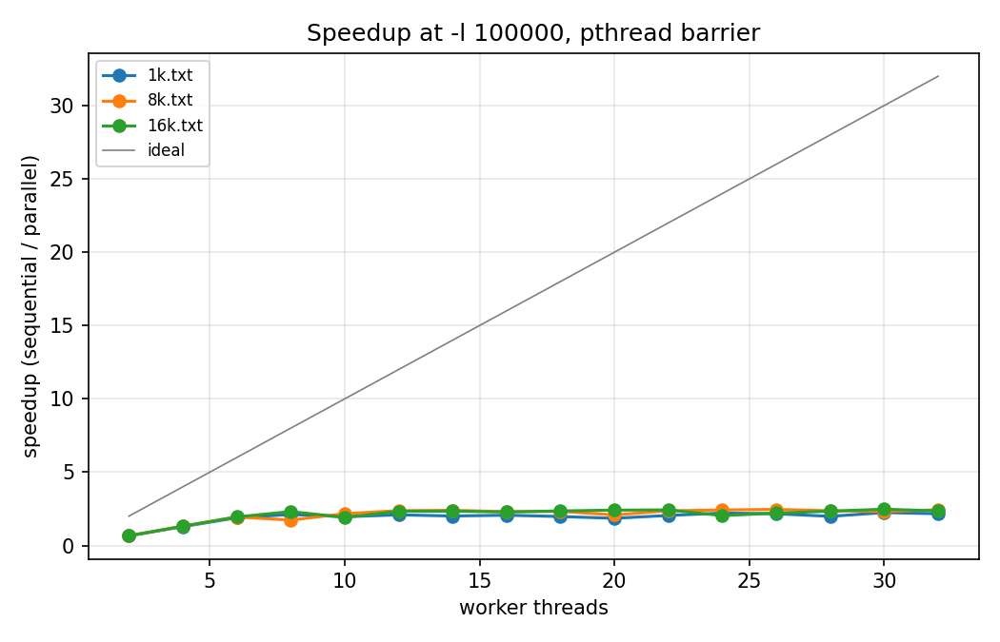
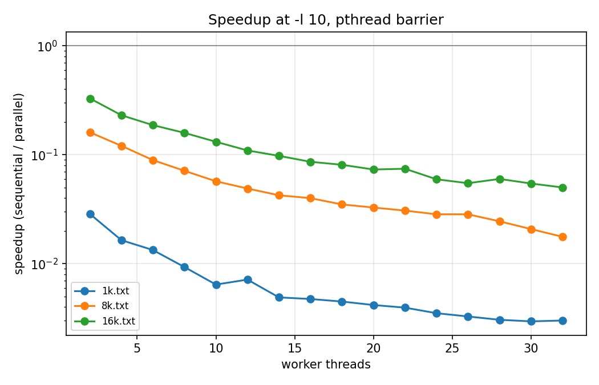
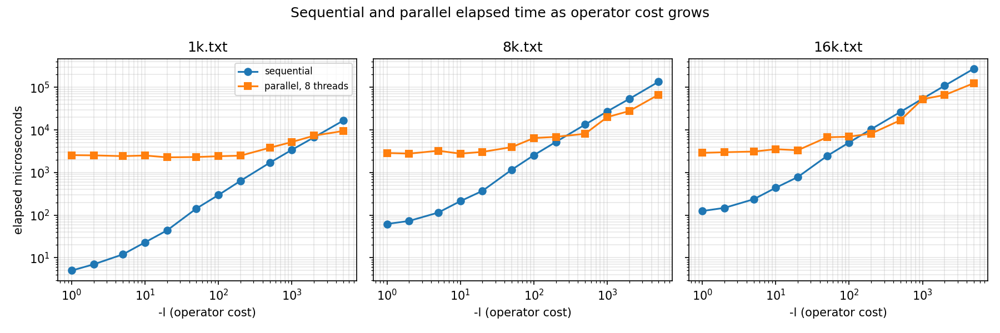
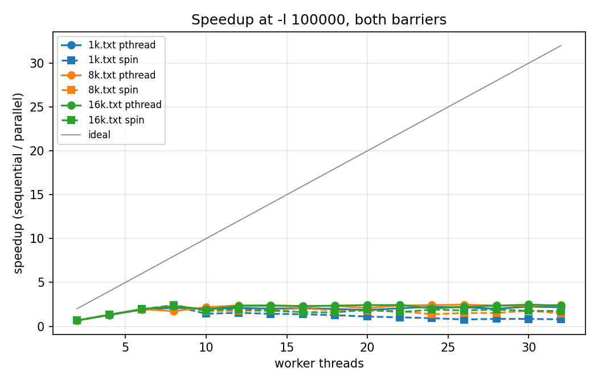
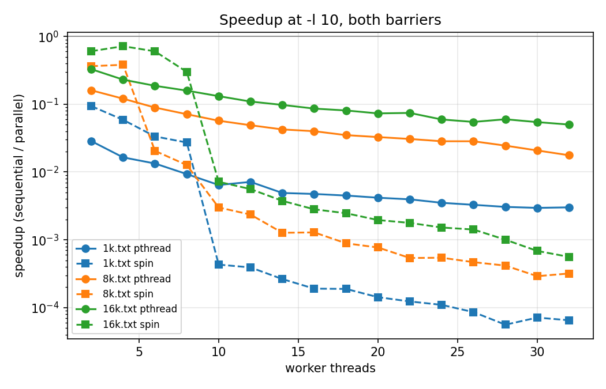

# CS380P Lab 1: Prefix Scan and Barriers

Kyle Stanford

---

## Introduction

This report covers my implementation of a work-efficient parallel prefix scan using pthreads,
the measurements I took with the library barrier and with a barrier I wrote myself, and my
discussion of the three steps in the assignment.

All measurements were taken on the Codio environment, which reports 8 cores. Each configuration
was run five times and the minimum was kept, since the machine is shared and interference from
other tenants can only make a run slower, never faster. Timing uses the skeleton's existing
instrumentation, which covers the scan only. Buffer allocation and barrier construction happen
before the timer starts.

---

## Implementation

**The scan.** I used the work-efficient algorithm described in the GPU Gems chapter the
assignment references. The array is treated as a balanced binary tree. An up-sweep reduces
pairs going up the tree until the last slot holds the total. The root is then set to the
identity, and a down-sweep pushes partial sums back down, leaving an exclusive scan. Each sweep
performs `n - 1` operator calls, so total work is `O(n)`, matching the sequential version.

The assignment requires an inclusive scan, so a third pass combines each element of the
exclusive result with the corresponding input. That pass is fully data-parallel.

Input size is not guaranteed to be a power of two, so the array is padded up to one with zeros,
the identity for the operator. Padding cannot change any real output. All four supplied inputs
happen to be powers of two, so I generated a 1000-element input to exercise this path.

Threads divide the nodes active at the current tree level, taking contiguous slices with the
remainder spread across the leading threads. At the upper levels there are fewer active nodes
than threads, so some threads get empty slices, but they still participate in every barrier.
A run on 16384 elements crosses 31 barriers.

One property of this algorithm explains most of the results below, so I want to state it up
front. The two sweeps plus the inclusive conversion perform roughly `3n` operator calls against
`n` for the sequential loop. The scan is work-efficient in the asymptotic sense the assignment
requires, but the constant factor is 3. On `p` cores the best achievable speedup is therefore
about `p/3`, not `p`.

**The barrier.** For step 3 I wrote a centralised sense-reversing barrier on top of
`pthread_spinlock_t`. The spinlock guards an arrival counter. The last thread to arrive resets
the counter and flips a shared `std::atomic<bool>`. Everyone else spins on that flag.

Sense reversal is what makes it re-entrant across all 31 rounds. Each thread keeps a
`thread_local` copy of the value it expects and inverts it on entry, so consecutive rounds
release on alternating values. Without it, a thread released from one round could run ahead,
reach the next barrier, see the flag still set from the previous round, and pass through a
barrier it should have waited at. The flag is atomic both to stop the compiler hoisting the
load out of the spin loop at `-O3` and to give the memory ordering that makes the previous
level's writes visible after the barrier.

**Correctness.** I verified parallel output against the `-n 0` sequential path across five
inputs and nine thread counts including 3, 5 and 13, with and without `-s`. All 45 cases match
on both barriers.

---

## Step 1 Discussion

Speedup is sequential time divided by parallel time, so higher is better and the grey diagonal
is ideal linear scaling.

| Threads | 1k | 8k | 16k |
|---|---|---|---|
| 2 | 0.65 | 0.67 | 0.66 |
| 4 | 1.29 | 1.31 | 1.31 |
| 6 | 1.89 | 1.95 | 1.95 |
| 8 | 2.12 | 1.73 | 2.31 |
| best | 2.24 | 2.46 | 2.47 |

### Explain the trends in the graph. Why do these occur?

There are three regions.

**Two threads are slower than sequential, by almost exactly 1.5x on every input.** This is not
overhead, it is the work constant. The parallel algorithm does three times the operator calls
of the sequential loop, so two threads each do 1.5 times the work one sequential thread does.
The predicted slowdown is 1.50 and I measured 1.53, 1.50 and 1.51. Getting the same ratio on
three different input sizes is what convinced me this is the work complexity rather than noise.

**From four to eight threads speedup climbs roughly linearly, but on a shallower slope than
ideal.** Each thread added divides the same `3n` work further, so the curve tracks `p/3` rather
than `p`. Parallel first beats sequential between two and four threads, which is where triple
work divided `p` ways starts to beat single work done once.

**Past eight threads the curve flattens.** The machine has 8 cores, so there is no more
parallelism to exploit. Extra threads add barrier participants and scheduling pressure without
adding throughput, and the best results cluster between 2.2 and 2.5 no matter how many threads
beyond 8 I use.

The ceiling is worth stating explicitly. With 8 cores and a work constant of 3, the maximum is
`8/3 = 2.67`. I measured 2.47 on 16k and 2.46 on 8k, which is about 93 percent of that bound.
So the distance between my curve and the ideal diagonal is explained almost entirely by the
algorithm doing three times the work, not by my synchronisation being inefficient.

Larger inputs scale slightly better, 2.47 on 16k against 2.24 on 1k. Barrier count grows as
`log2(n)` while work grows as `n`, so going from 1024 to 16384 elements multiplies work by 16
while barrier crossings only rise from 21 to 31. Coordination gets amortised over more work.

---

## Step 2 Discussion

### What happened and why?

The parallel version never beats sequential at any thread count on any input, and it gets worse
as threads are added. On 1k the sequential scan takes 23 microseconds while two threads take
804, a 35-fold slowdown, and 32 threads take 7637, a 332-fold slowdown.

The useful work collapsed but the coordination cost did not. At `-l 100000` each operator call
is expensive enough that real computation dominates. At `-l 10` an operator call is a handful of
instructions, so a 1024-element scan is only microseconds of actual work. Against that, thread
creation, 21 barrier crossings and moving the array between core caches are enormous.

That is also why the curves slope downward instead of flattening. Every extra thread is another
participant everyone must wait for at all 21 barriers, and it contributes nothing meaningful,
because there was never enough work to justify even the first two threads.

The slowdown is least severe on the largest input, 3x on 16k at two threads against 35x on 1k,
for the same reason as in step 1: more work sitting between each pair of barriers.

### The inflection point

I swept `-l` from 1 to 5000 with the thread count fixed at 8 and compared against sequential.

| Input | Sequential still faster at | Parallel faster at | Crossover near |
|---|---|---|---|
| 1k | `-l 2000` (6701 vs 7341 us) | `-l 5000` (16577 vs 9457 us) | `-l` ≈ 2500 |
| 8k | `-l 200` (5236 vs 6894 us) | `-l 500` (13388 vs 8138 us) | `-l` ≈ 300 |
| 16k | `-l 100` (5084 vs 6943 us) | `-l 200` (10461 vs 8234 us) | `-l` ≈ 150 |

Sixteen times more data moves the crossover down by roughly a factor of 16.

### Why can changing this number make the sequential version faster than the parallel?

Because `-l` sets how much useful work each operator call represents, while the parallel
version's overhead is nearly independent of it.

The parallel column in that sweep makes this concrete. Between `-l 1` and `-l 100` on 1k,
parallel time barely moves: 2563, 2532, 2428, 2513, 2275, 2315, 2417 microseconds. Over the same
range sequential time climbs from 5 to 297 microseconds, tracking `-l` almost exactly. The
parallel version is sitting on a floor of about 2500 microseconds made of thread creation and
barrier crossings, and it pays that floor whether the operator is trivial or expensive.

So I am comparing a sequential cost that scales with `n * l` against a parallel cost of roughly
`(3 * n * l) / p` plus a fixed coordination term. Small `l` means the fixed term dominates and
sequential wins easily. Large `l` means the fixed term becomes negligible and the `3/p` factor
takes over. The crossover is wherever useful work finally exceeds coordination cost, and a
bigger `n` reaches that total at a smaller `l`, which is why the inflection point drops as the
input grows.

### What is the most important characteristic of the operator that makes this happen?

Its cost relative to the cost of synchronising once. That is the whole thing, and it
generalises past the `-l` knob.

`-l` is just a convenient way to manufacture operators of different expense. A real scan might
combine large structs, concatenate strings, or do floating-point work on vectors. What decides
whether parallelising is worth it is the ratio between one operator application and one barrier
crossing, weighted by how many elements each thread gets to process between barriers.

With `n` elements, `p` threads and `2 log2(n)` barriers, each thread handles about
`3n / (p * 2 log2 n)` operator calls per barrier interval. Multiply that by operator cost and
compare against barrier cost. Cheap operators lose, expensive operators win, and a larger `n`
helps because it puts more elements into each interval without raising the number of intervals
proportionally.

Associativity matters too, but it is not the limiting factor here. The operator must be
associative for the tree restructuring to be valid at all. The supplied operator is addition in
disguise, so it qualifies. A non-associative operator could not use this algorithm at any `-l`.

---

## Step 3 Discussion

Speedups using `-s` at `-l 100000`:

| Threads | 1k | 8k | 16k |
|---|---|---|---|
| 2 | 0.66 | 0.66 | 0.66 |
| 4 | 1.31 | 1.31 | 1.30 |
| 6 | 1.90 | 1.92 | 1.95 |
| 8 | 2.31 | 2.42 | 2.39 |
| 16 | 1.37 | 2.07 | 1.62 |
| 32 | 0.79 | 1.47 | 1.74 |

### Explain the trends in the graph. Why do these occur?

Up to 8 threads my barrier is indistinguishable from the pthread version, and slightly better
at 8. That is expected. In this region the work constant of 3 dominates everything, so barrier
choice is a small share of total time, and the cheaper release gives my version a modest edge.

Past 8 threads the two diverge sharply. The pthread version plateaus near 2.3 and stays there.
Mine peaks at 8 threads and then declines, reaching 0.79 on 1k at 32 threads, which is slower
than sequential. This is oversubscription. The decline is steepest on the smallest input,
because 1k has the least work per barrier interval and so spends the highest proportion of its
time in barriers to begin with.

The `-l 10` graph shows the same thing far more starkly, since barrier cost is nearly all of the
runtime there. My barrier beats the pthread barrier by about 3x up to 8 threads and then falls
off a cliff between 8 and 10.

### How is / isn't my implementation different from pthread barriers?

Structurally they are similar. Both count arrivals, release the group when the count reaches the
thread total, and are reusable across rounds.

The difference is what a waiting thread does. `pthread_barrier_wait` blocks. A thread that
arrives early is descheduled by the kernel, typically via a futex, and woken when the last
thread arrives, so it gives up its core while waiting. The cost is a system call going in and a
context switch each way, plus whatever cache warmth it loses.

Mine never blocks. A waiting thread runs a tight loop reading one atomic variable, so there is
no system call and no context switch, and release latency is roughly the time for a cache line
to move between cores. The price is that the thread holds its core for the whole wait and does
nothing useful with it.

Two smaller differences. The library implementation is tuned and may spin briefly before
sleeping, whereas mine is unconditionally a spin. And mine serialises arrivals through one
spinlock on one cache line, so arrival cost grows with thread count, where a production barrier
might use a tree or combining structure to cut that contention.

### In what scenarios would each implementation perform better than the other?

Comparing spin time to pthread time at `-l 10`, where below 1 means mine is faster:

| Threads | 1k | 8k | 16k |
|---|---|---|---|
| 2 | 0.30 | 0.44 | 0.54 |
| 4 | 0.28 | 0.32 | 0.32 |
| 6 | 0.40 | 4.35 | 0.31 |
| 8 | 0.34 | 5.62 | 0.53 |
| 10 | 14.9 | 19.0 | 18.3 |
| 32 | 46.3 | 55.4 | 89.4 |

**Mine wins when threads fit on cores.** Up to 8 threads it is consistently about three times
faster, because the wait is short and spinning skips the syscall and context switch entirely.
When every participant is running at once, the last arrival comes quickly and spinning wastes
almost nothing. The same holds at `-l 100000` at 8 threads, where spin beats pthread on all
three inputs.

**The pthread barrier wins as soon as threads exceed cores.** At 10 threads mine is 15 to 19
times slower and at 32 threads it is 46 to 89 times slower. With more threads than cores some
participants are not scheduled, and the threads that already arrived spin on exactly the cores
those unarrived threads need in order to run. Each barrier then costs a scheduler quantum rather
than a cache line transfer. The pthread barrier avoids this because sleeping threads hand their
cores to the threads that still need to make progress.

The 8k readings at 6 and 8 threads, 4.35 and 5.62, go against the pattern. I think those are
interference from other tenants on the shared machine rather than a real effect, since the same
configuration on 1k and 16k stays well below 1, and the `-l 100000` sweep shows 8k spin beating
pthread at 8 threads.

### What are the pathological cases for each?

**Mine, more threads than cores.** Shown above, up to 89x worse. More generally any long wait
that is not caused by real work, including badly imbalanced workloads where one thread has far
more to do than the rest. Every other thread burns a core doing nothing for the whole imbalance.

**Mine, near-zero work between barriers.** At `-l 1` and `-l 2` my timings became wildly
unstable, for example 47948 and 74578 microseconds on 1k against roughly 900 microseconds at
`-l 10`. Minimum-of-five did not remove this, which says it is systematic rather than
interference. With no work between rounds, eight threads contend continuously on a single
spinlock cache line. This is why I based the crossover points in step 2 on the pthread
measurements, which are stable, rather than the spin ones.

**pthread barrier, frequent synchronisation with threads fitting on cores.** Exactly my `-l 10`
case at 8 threads. The wait is genuinely short, but every crossing still pays a futex round trip
and two context switches, which is why my barrier beats it threefold there. Any fine-grained
parallel loop with many short phases hits this.

### How do the results from part 2 and part 3 compare? Are they in line with your expectations?

They match up to the core count and diverge past it.

Partly what I expected, partly not. I expected the spin barrier to win at low thread counts,
since skipping a syscall on a short wait is an obvious gain, and it did, by about three times at
`-l 10`. I expected it to lose under oversubscription, and it did.

What I did not expect was how sharp the transition is. I assumed degradation would come on
gradually as thread count rose past 8. Instead the ratio goes from about 0.35 at 8 threads to
about 18 at 10 threads, a fiftyfold change from adding two threads. In hindsight the mechanism
is a threshold rather than a slope. At 8 threads every participant can be resident at once. At 9
at least one cannot, so at least one barrier crossing per round has to wait on a descheduled
thread while everyone else spins. The condition is binary, so the performance change is too.

I also did not expect my barrier to be unstable at very low `-l`. That it did not average out
over five runs was the surprise, and it changed how I reported the crossover points.

### What overheads cause the implementation to underperform ideal speedup?

In order of size.

**The work constant, by far.** About `3n` operator calls against the sequential `n`, capping
speedup at 2.67 on 8 cores. Measured peak is 2.47, so this one factor accounts for roughly three
quarters of the gap to ideal. It is inherent to the work-efficient tree formulation: the price
of `O(n)` work instead of `O(n log n)` is two passes over the data plus a third to convert
exclusive to inclusive.

**Idle threads at the upper tree levels.** The top of the up-sweep has 4, then 2, then 1 active
nodes. With 8 threads most have nothing to do but must still reach the barrier, so the top
`log2(p)` levels of each sweep are effectively serial.

**Barrier latency.** 31 crossings per run, each needing every thread to arrive and be released.
Small relative to the work at `-l 100000`, and essentially the entire runtime at `-l 10`.

**Thread creation and teardown.** Paid once per run and roughly constant. Visible as the 2500
microsecond floor in the inflection sweep.

**Memory traffic.** Both sweeps write the whole padded array, and adjacent tree nodes touched by
different threads share cache lines, so there is false sharing at the finer levels and line
migration between cores throughout. I did not measure this separately.

**Hardware.** With 8 cores, everything past 8 threads is oversubscription, so that part of the
sweep measures scheduling behaviour rather than parallel scaling.

### Suggest workload scenarios which would make each implementation perform worse than the other

**Favouring my spin barrier:** a fine-grained parallel loop with many short phases, thread count
set equal to core count, threads pinned. Short waits, no oversubscription, and the futex round
trip avoided at every one of many barriers. My own `-l 10` case at 8 threads is exactly this.
Also a latency-sensitive pipeline where what matters is time from last arrival to everyone
resuming rather than total CPU burned, and a dedicated machine with no other tenants, where
holding a core while waiting costs nothing because nobody else wants it.

**Favouring the pthread barrier:** any thread count above the core count, shown above up to 89x.
Also a shared or virtualised machine, which Codio is, since the hypervisor can deschedule a
virtual CPU even at the nominal core count and every spinning thread then wastes real cycles
another tenant could use. Also imbalanced workloads where one thread consistently arrives much
later, since all the early arrivals spin through the entire imbalance instead of yielding. Also
coarse-grained work with long phases between rare barriers, where the futex cost amortises to
nothing and blocking frees cores for other work. And anything where power or CPU accounting
matters, since a spinning thread looks fully busy to the scheduler and to a billing meter while
accomplishing nothing.

---

## Time spent

Approximately TODO hours.
